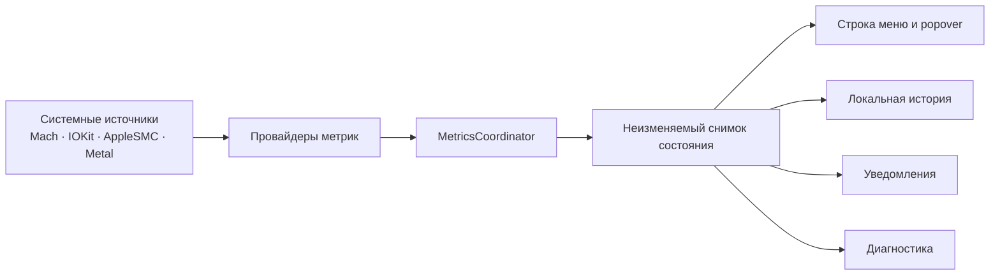

<div align="center">

# MacVitals

### Красивый нативный монитор состояния Mac в строке меню macOS

CPU, память, батарея, питание, температуры, процессы и доступные данные вентиляторов — локально, честно и без телеметрии.

<p>
  
  
  
  
  
</p>

**Русский** · [English](README_EN.md) · [Архитектура](ARCHITECTURE.md) · [Приватность](PRIVACY.md)

</div>

<p align="center">
  
</p>

> [!IMPORTANT]
> MacVitals находится на предрелизной стадии. Исходный код версии 1.0.0 собирается и тестируется для Apple Silicon, но подписанный и notarized-релиз пока не опубликован. Изображения в README — специально подготовленные продуктовые концепты, а не буквальные снимки текущей сборки.

## О проекте

**MacVitals** — нативное menu-bar приложение для macOS, которое показывает ключевые показатели системы без отдельного тяжёлого окна и без отправки данных наружу.

Приложение объединяет системные метрики в одном компактном интерфейсе, явно показывает источник и качество данных и не подменяет отсутствующие значения догадками. Если конкретный датчик или API недоступен на данном Mac, MacVitals честно сообщает об этом.

<table>
  <tr>
    <td width="25%" align="center"><strong>⚡ Быстро</strong><br><sub>Нативные SwiftUI и AppKit без веб-оболочки</sub></td>
    <td width="25%" align="center"><strong>🔒 Приватно</strong><br><sub>Локальная обработка, без аккаунтов и телеметрии</sub></td>
    <td width="25%" align="center"><strong>🎯 Честно</strong><br><sub>Недоступные показатели не заменяются выдуманными</sub></td>
    <td width="25%" align="center"><strong> Для Mac</strong><br><sub>Apple Silicon, macOS 13 и новее</sub></td>
  </tr>
</table>

## Основные возможности

| Область | Что показывает MacVitals |
|---|---|
| **CPU** | Текущую загрузку на основе разницы системных Mach-счётчиков и короткую локальную историю |
| **Память** | Использование RAM и нативное состояние memory pressure macOS |
| **Батарея** | Заряд, состояние зарядки, здоровье и доступные расширенные поля |
| **Питание** | Номинальную и согласованную мощность адаптера отдельно от измеренного или вычисленного потребления |
| **Температуры** | Температуру батареи и процессора, когда соответствующий источник доступен |
| **GPU** | Модель и возможности Metal GPU без выдуманной загрузки при отсутствии надёжного API |
| **Вентиляторы** | Доступные RPM, пределы и режимы через AppleSMC; мониторинг остаётся безопасным и read-only в unsigned-сборках |
| **Процессы** | Приложения и процессы с наибольшим текущим потреблением ресурсов |
| **История** | Ограниченные кольцевые буферы в памяти с корректной обработкой сна и пробуждения |
| **Уведомления** | Локальные предупреждения с cooldown и явным запросом разрешения |
| **Диагностика** | Состояние провайдеров и экспорт обезличенного JSON-отчёта по выбору пользователя |

## Интерфейс

MacVitals живёт в строке меню macOS. Основные значения остаются видимыми постоянно, а по нажатию открывается компактный обзор с карточками метрик, графиками, питанием, процессами и быстрым переходом к настройкам.

Приложение поддерживает:

- русский и английский языки;
- светлую и тёмную темы;
- двухцветную и многоцветную схемы;
- настраиваемый состав показателей в строке меню;
- готовые пресеты и ручную сортировку метрик;
- нативную клавиатурную навигацию и accessibility-идентификаторы.

### Галерея концептов

<table>
  <tr>
    <td width="50%" valign="top">
      <strong>⚙️ Основные настройки</strong><br>
      <sub>Интервал обновления, история, автозапуск, Dock и оформление.</sub><br><br>
      
    </td>
    <td width="50%" valign="top">
      <strong>📊 Строка меню</strong><br>
      <sub>Наборы метрик, порядок, формат и компактность отображения.</sub><br><br>
      
    </td>
  </tr>
  <tr>
    <td width="50%" valign="top">
      <strong>🌀 Вентиляторы и безопасность</strong><br>
      <sub>Доступные RPM, ограничения и понятные границы безопасной работы.</sub><br><br>
      
    </td>
    <td width="50%" valign="top">
      <strong>🩺 Диагностика</strong><br>
      <sub>Сводка системы, состояние источников и обезличенный экспорт.</sub><br><br>
      
    </td>
  </tr>
</table>

Реальные XCTest-снимки работающего приложения сохранены в [`docs/screenshots/`](docs/screenshots/) как техническое подтверждение. Концепты используются только для красивой презентации направления интерфейса.

## Как устроен MacVitals



Архитектура разделяет получение данных, доменные модели, координацию выборки, представление и диагностику:

- `MetricValue` хранит значение, единицу, доступность, качество, источник, время и признак оценки;
- провайдеры не решают, как должна выглядеть метрика в интерфейсе;
- `MetricsCoordinator` управляет жизненным циклом опроса и публикует неизменяемые снимки;
- AppKit отвечает за `NSStatusItem` и `NSPopover`, SwiftUI — за содержимое и настройки;
- короткая история хранится только в ограниченных кольцевых буферах памяти;
- после сна сбрасываются CPU-baseline и окна мощности, а графики получают корректный разрыв;
- private GPU utilization API, сетевые сервисы и базы данных в v1 намеренно не используются.

Подробнее: [ARCHITECTURE.md](ARCHITECTURE.md).

## Принципы достоверности данных

MacVitals следует нескольким жёстким правилам:

1. **Не выдумывать отсутствующие значения.** Недоступная метрика отображается как недоступная.
2. **Отделять паспортные данные от измерений.** Мощность адаптера не выдаётся за текущее потребление Mac.
3. **Показывать происхождение оценки.** Вычисленные значения помечаются отдельно от прямых измерений.
4. **Проверять возможности во время выполнения.** Расширенные датчики включаются только там, где они действительно доступны.
5. **Не обещать универсальную точность.** Набор датчиков зависит от модели Mac, версии macOS и среды выполнения.

## Платформа и требования

| Компонент | Требование |
|---|---|
| Архитектура | Только Apple Silicon (`arm64`) |
| macOS | 13 Ventura или новее |
| Xcode | 16 или новее |
| Swift | 6.0, strict concurrency |
| Генерация проекта | XcodeGen |
| Лицензия | MIT |

Intel (`x86_64`) и universal release-сборки намеренно отклоняются проверками проекта.

## Быстрый старт из исходников

> [!NOTE]
> Публичной подписанной сборки пока нет. Ниже описан запуск для разработчиков и тестирования.

```bash
git clone https://github.com/MishkaStrategy/-MacVitals.git
cd -- -MacVitals
git switch main
make bootstrap
open MacVitals.xcodeproj
```

Сборка из терминала:

```bash
make build
```

Запуск unit-тестов:

```bash
make test
```

## Команды разработчика

| Команда | Назначение |
|---|---|
| `make bootstrap` | Подготавливает иконку, устанавливает XcodeGen при необходимости и генерирует проект |
| `make build` | Собирает Debug-версию для macOS ARM64 |
| `make test` | Запускает unit-тесты MacVitals |
| `make format` | Форматирует Swift-код |
| `make lint` | Проверяет форматирование без изменений |
| `make validate-tooling` | Проверяет скрипты, локализации, метаданные и безопасность путей |
| `make package VERSION=0.0.0` | Создаёт явно unsigned ZIP и DMG |
| `make verify-package VERSION=0.0.0` | Проверяет структуру и метаданные пакета |
| `make runtime-smoke VERSION=0.0.0` | Собирает пакет и выполняет короткую проверку запуска |
| `make collect-runtime RUNTIME_DURATION=900 RUNTIME_INTERVAL=2` | Сохраняет процессные CPU/RSS/VSZ/thread-метрики запущенного приложения |
| `make clean` | Удаляет сгенерированный проект, сборки и временные артефакты |

## Приватность

MacVitals обрабатывает системные измерения локально и не передаёт их в сеть.

В приложении нет:

- аккаунтов и авторизации;
- аналитики и телеметрии;
- рекламы;
- удалённой конфигурации;
- облачного backend;
- фоновой отправки диагностических данных;
- доступа к пользовательским документам.

Диагностический пакет создаётся только по явному действию пользователя и сохраняется в выбранное им место. Из него исключаются имена пользователей, домашние пути, серийные номера, Apple ID, персональные файлы, сетевые данные и устойчивые аппаратные идентификаторы.

Подробнее: [PRIVACY.md](PRIVACY.md).

## Ограничения и безопасность

- macOS не предоставляет единый публичный API для достоверной общей загрузки GPU на всех поддерживаемых Mac;
- часть температурных и энергетических данных зависит от конкретной модели и версии macOS;
- расширенные поля батареи проверяются во время выполнения и считаются экспериментальными;
- мониторинг вентиляторов в unsigned-сборках остаётся read-only;
- физическое управление вентиляторами не заявляется как готовая или поддерживаемая функция;
- автоматические показатели на hosted runner являются регрессионными доказательствами, а не обещанием производительности на любом Mac;
- Developer ID signing, notarization, stapling и Gatekeeper-проверка чистой машины ещё не завершены.

## Состояние проекта

На текущем этапе проверяются:

- генерация Xcode-проекта и Swift formatting;
- нативная ARM64-сборка;
- unit- и UI-тесты;
- русская и английская локализация;
- accessibility smoke интерфейса;
- упаковка unsigned ZIP и DMG;
- контрольные суммы, manifest и build provenance;
- packaged-app runtime smoke;
- read-only проверка доступных fan RPM;
- длительные process-level замеры и физические Instruments-сессии.

До публичного релиза остаются подписание, notarization, Gatekeeper-проверка, финальный ручной UX/accessibility review и отдельное явное разрешение на создание тега и релиза.

## Документация

- [English README](README_EN.md)
- [Архитектура](ARCHITECTURE.md)
- [Приватность](PRIVACY.md)
- [Концептуальные изображения](docs/concepts/README.md)
- [Реальные тестовые снимки](docs/screenshots/README.md)
- [Модель питания](docs/POWER_MODEL.md)
- [Совместимость датчиков](docs/SENSOR_COMPATIBILITY.md)
- [Performance evidence](docs/PERFORMANCE.md)
- [Build provenance](docs/BUILD_PROVENANCE.md)
- [Процесс релиза](docs/RELEASE.md)
- [Политика безопасности](SECURITY.md)

## Участие в разработке

Проект открыт для issue, предложений и pull request. Перед изменениями ознакомьтесь с [CONTRIBUTING.md](CONTRIBUTING.md), архитектурными ограничениями и политикой безопасности.

<div align="center">

**MacVitals создаётся для тех, кто хочет понимать состояние своего Mac, а не отдавать его данные наружу.**

Распространяется по лицензии [MIT](LICENSE).

</div>
