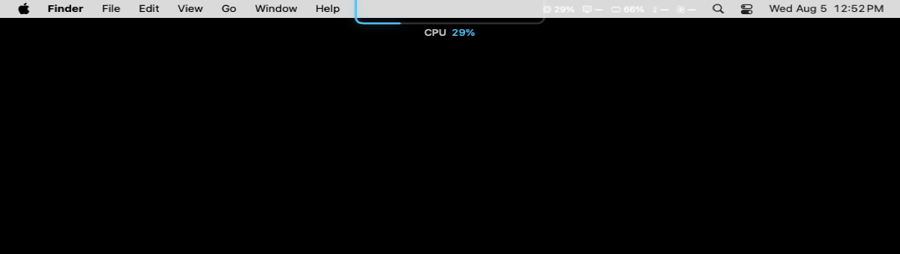

<div align="center">

# MacVitals

### Native Mac health monitoring in the menu bar and around the camera notch

CPU, memory, battery, power, temperatures, processes, fan telemetry, a configurable status item and an optional notch HUD — processed locally on Apple Silicon.

<p>
  
  
  
  
  
</p>

**English** · [Русский](README_RU.md) · [Architecture](ARCHITECTURE.md) · [Privacy](PRIVACY.md)

</div>

<p align="center">
  <a href="docs/screenshots/status-bar-overview.png">
    
  </a>
</p>

> [!IMPORTANT]
> MacVitals v1 is still in pre-release validation. The current Apple Silicon build is unsigned. Developer ID signing, notarization, stapling, final accessibility review and a public release have not been completed.

## What MacVitals is

MacVitals is a native SwiftUI and AppKit application that keeps useful system information close without requiring an account, a browser dashboard or a cloud service.

It presents live values in three complementary surfaces:

- a compact configurable item in the macOS menu bar;
- an overview popover with cards, history, power interpretation and process consumers;
- an optional contour HUD around the camera notch with one or two selected sensors.

<table>
  <tr>
    <td width="25%" align="center"><strong>Native</strong><br><sub>Swift 6, SwiftUI and AppKit</sub></td>
    <td width="25%" align="center"><strong>Local</strong><br><sub>No accounts, ads or telemetry</sub></td>
    <td width="25%" align="center"><strong>Transparent</strong><br><sub>Missing values are never fabricated</sub></td>
    <td width="25%" align="center"><strong>Mac-first</strong><br><sub>Apple Silicon and macOS 13+</sub></td>
  </tr>
</table>

## Status bar and overview

The status item can show a selected and ordered set of metrics. Clicking it opens the real MacVitals overview with CPU, memory, GPU, battery, temperature and fan cards, power-flow interpretation, recent CPU history and shortcuts to deeper views.

The image at the top of this page is a direct full-screen XCTest capture of the running application. It is not a mockup or a generated interface concept.

## Notch HUD

<p align="center">
  <a href="docs/screenshots/notch-hud.png">
    
  </a>
</p>

The optional HUD uses one transparent AppKit `NSPanel` and draws a U-shaped contour around the hardware notch. It supports:

- one full-contour indicator or two independent half-contour indicators;
- selectable live sensors;
- optional value and sensor labels;
- automatic, accent or custom colors;
- warning and critical thresholds;
- configurable thickness, width, track opacity, glow and animation;
- fail-closed behavior when reliable notch geometry is unavailable.

The HUD screenshot is produced by the real application renderer. On a hosted Mac without a physical notch, the capture workflow enables the app's built-in simulated-contour option. Hardware geometry and one-panel behavior have also been validated separately on a physical notched Apple Silicon Mac.

## System information

| Area | What MacVitals reports |
|---|---|
| **CPU** | Usage from delta-based Mach host counters and bounded local history |
| **Memory** | RAM, swap and native macOS memory-pressure state |
| **Battery** | Charge level, charging state, health and capability-checked extended fields |
| **Power** | Adapter rated and negotiated power kept separate from measured or derived system power |
| **Temperatures** | Battery and processor readings when a trustworthy provider is available |
| **GPU** | Metal identity and capabilities; utilization only when a reliable provider exists |
| **Fans** | Available RPM, target and limit values and operating mode through AppleSMC |
| **Processes** | Applications and processes with the highest current resource use |
| **History** | Bounded in-memory buffers with explicit sleep and wake discontinuities |
| **Alerts** | Local notifications with cooldown and explicit permission handling |
| **Diagnostics** | Provider availability, sampling information and a privacy-filtered support bundle |

## Real settings screens

Every image below is a direct XCTest window capture from the actual application.

<table>
  <tr>
    <td width="50%" valign="top">
      <strong>General</strong><br>
      <sub>Sampling interval, Dock visibility, login launch and session state.</sub><br><br>
      <a href="docs/screenshots/preferences-general.png"></a>
    </td>
    <td width="50%" valign="top">
      <strong>Menu bar</strong><br>
      <sub>Live preview, presets and ordered metric composition.</sub><br><br>
      <a href="docs/screenshots/preferences-menu-bar.png"></a>
    </td>
  </tr>
  <tr>
    <td width="50%" valign="top">
      <strong>Fans and safety</strong><br>
      <sub>Available telemetry and explicit unsigned-build safety boundaries.</sub><br><br>
      <a href="docs/screenshots/preferences-fans.png"></a>
    </td>
    <td width="50%" valign="top">
      <strong>Diagnostics</strong><br>
      <sub>Provider availability, version information and support-bundle export.</sub><br><br>
      <a href="docs/screenshots/preferences-diagnostics.png"></a>
    </td>
  </tr>
</table>

The reproducible capture implementation is in [`.github/workflows/readme-screenshots.yml`](.github/workflows/readme-screenshots.yml) and `MacVitalsUITests`.

## Data-integrity principles

1. **Never invent an unavailable value.** Missing or unsupported data stays unavailable.
2. **Separate specifications from measurements.** Adapter wattage is not presented as live Mac consumption.
3. **Expose derived values.** Direct, calculated and experimental readings remain distinguishable.
4. **Check hardware capability at runtime.** Model-dependent providers activate only when supported.
5. **Fail safely.** HUD geometry and fan-related paths do not silently fall back to unsafe behavior.

## Supported platform

| Component | Requirement |
|---|---|
| Architecture | Apple Silicon (`arm64`) only |
| macOS | 13 Ventura or later |
| Xcode | 16 or later |
| Swift | 6 with strict concurrency |
| Project generation | XcodeGen |
| License | MIT |

Intel and universal release binaries are intentionally rejected by project validation.

## Build from source

```bash
git clone https://github.com/MishkaStrategy/-MacVitals.git
cd -- -MacVitals
git switch feature/macvitals-v1
make bootstrap
open MacVitals.xcodeproj
```

Common commands:

```bash
make validate-tooling
make build
make test
make package VERSION=0.0.0
make runtime-smoke VERSION=0.0.0
```

Unsigned package output includes ZIP, DMG, checksums, `BUILD_STATUS.txt` and `BUILD_MANIFEST.json`.

## Privacy

MacVitals processes measurements locally and contains no account system, analytics, telemetry, advertising, cloud backend or automatic diagnostic upload.

A support bundle is created only through an explicit user action and is designed to exclude usernames, home paths, serial numbers, Apple IDs, personal files, network information and stable personal identifiers.

See [PRIVACY.md](PRIVACY.md).

## Limitations and safety

- macOS does not expose one universal public API for reliable whole-system GPU utilization across every supported Mac;
- temperature, power, battery and fan coverage varies by hardware and macOS version;
- extended IORegistry battery fields are capability-checked and treated as experimental;
- unsigned builds keep fan behavior within explicit safety restrictions;
- physical fan control is not claimed as release-ready;
- hosted screenshot values describe the runner, not every Mac;
- signing, notarization, stapling and clean-Mac Gatekeeper validation remain pending.

## Validation status

The current validation pipeline covers native ARM64 build and tests, bilingual UI checks, unsigned packaging, checksum and provenance verification, packaged runtime smoke, read-only fan evidence, physical direct-session scenarios, notch geometry and one-panel HUD behavior.

Before a public release, MacVitals still requires final manual UX/accessibility review, Developer ID signing, notarization, Gatekeeper validation and explicit authorization for merge, tag and release actions.

## Documentation

- [Русский README](README_RU.md)
- [Architecture](ARCHITECTURE.md)
- [Privacy](PRIVACY.md)
- [Power model](docs/POWER_MODEL.md)
- [Sensor compatibility](docs/SENSOR_COMPATIBILITY.md)
- [Performance evidence](docs/PERFORMANCE.md)
- [Build provenance](docs/BUILD_PROVENANCE.md)
- [Release process](docs/RELEASE.md)

<div align="center">

**Understand your Mac without sending its measurements elsewhere.**

Released under the [MIT License](LICENSE).

</div>
