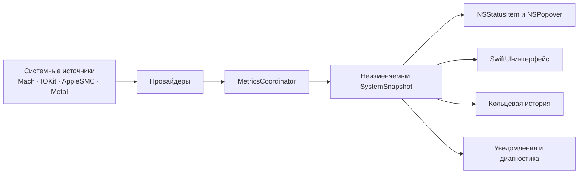

<div align="center">

# MacVitals

### Нативный монитор состояния Apple Silicon Mac в строке меню macOS

CPU, память, батарея, питание, температуры, процессы и доступные данные вентиляторов — локально, прозрачно и без телеметрии.

<p>
  
  
  
  
  
</p>

**Русский** · [English](README_EN.md) · [Архитектура](ARCHITECTURE.md) · [Приватность](PRIVACY.md)

</div>

<p align="center">
  <a href="docs/screenshots/status-bar-overview.png">
    
  </a>
</p>

> [!IMPORTANT]
> MacVitals находится на предрелизной стадии. Код версии 1.0.0 собирается и тестируется для Apple Silicon, но подписанный и notarized-релиз пока не опубликован. Все изображения интерфейса ниже сняты XCTest-сценарием с реально запущенной ARM64-сборки и вставлены без перерисовки содержимого программы.

## О проекте

**MacVitals** — нативное menu-bar приложение для macOS, которое держит ключевые показатели системы рядом, не требует отдельной тяжёлой панели и не отправляет измерения наружу.

Приложение объединяет системные метрики в компактном popover, показывает источник и доступность данных и не заменяет отсутствующие значения догадками. Если датчик или системный API недоступен на конкретном Mac, интерфейс сообщает об этом прямо.

<table>
  <tr>
    <td width="25%" align="center"><strong>Нативно</strong><br><sub>Swift 6, SwiftUI и AppKit без веб-оболочки</sub></td>
    <td width="25%" align="center"><strong>Локально</strong><br><sub>Без аккаунтов, рекламы и телеметрии</sub></td>
    <td width="25%" align="center"><strong>Достоверно</strong><br><sub>Недоступные значения не подменяются выдуманными</sub></td>
    <td width="25%" align="center"><strong>Для Apple Silicon</strong><br><sub>ARM64 и macOS 13 или новее</sub></td>
  </tr>
</table>

## Возможности

| Область | Что показывает MacVitals |
|---|---|
| **CPU** | Текущую загрузку по разнице системных Mach-счётчиков и короткую локальную историю |
| **Память** | Использование RAM, swap и нативное состояние memory pressure macOS |
| **Батарея** | Заряд, состояние зарядки, здоровье и поддерживаемые расширенные поля |
| **Питание** | Номинальную и согласованную мощность адаптера отдельно от прямого или вычисленного потребления |
| **Температуры** | Температуру батареи и процессора, когда доступен надёжный источник |
| **GPU** | Модель и возможности Metal GPU; загрузка показывается только при наличии достоверного провайдера |
| **Вентиляторы** | Доступные RPM, целевые и предельные значения и режим через AppleSMC |
| **Процессы** | Приложения и процессы с наибольшим текущим потреблением ресурсов |
| **История** | Ограниченные кольцевые буферы в памяти с разрывами после сна и пробуждения |
| **Уведомления** | Локальные предупреждения с cooldown и явным запросом разрешения |
| **Диагностика** | Доступность провайдеров, длительность цикла выборки и обезличенный JSON-отчёт |

## Реальный интерфейс программы

MacVitals живёт в строке меню macOS. По нажатию открывается компактный popover с карточками CPU, памяти, GPU, батареи, температуры и вентиляторов, сводкой питания и локальной историей CPU.

Снимки ниже получены из работающего приложения, а не собраны как макеты.

<table>
  <tr>
    <td width="50%" valign="top">
      <strong>Основные настройки</strong><br>
      <sub>Частота мониторинга, Dock, запуск при входе и текущий сеанс.</sub><br><br>
      <a href="docs/screenshots/preferences-general.png">
        
      </a>
    </td>
    <td width="50%" valign="top">
      <strong>Строка меню</strong><br>
      <sub>Предпросмотр, профили и порядок отображаемых метрик.</sub><br><br>
      <a href="docs/screenshots/preferences-menu-bar.png">
        
      </a>
    </td>
  </tr>
  <tr>
    <td width="50%" valign="top">
      <strong>Вентиляторы и безопасность</strong><br>
      <sub>Реальный monitoring-only режим unsigned-сборки.</sub><br><br>
      <a href="docs/screenshots/preferences-fans.png">
        
      </a>
    </td>
    <td width="50%" valign="top">
      <strong>Диагностика</strong><br>
      <sub>Доступность провайдеров, версия и пакет поддержки.</sub><br><br>
      <a href="docs/screenshots/preferences-diagnostics.png">
        
      </a>
    </td>
  </tr>
</table>

> [!NOTE]
> Исходные PNG хранятся в [`docs/screenshots/`](docs/screenshots/), а воспроизводимый сценарий съёмки — в [`.github/workflows/readme-screenshots.yml`](.github/workflows/readme-screenshots.yml). Интерфейс на изображениях не дорисован и не заменён макетом.

## Принципы достоверности

1. **Не выдумывать отсутствующие значения.** Недоступная метрика отображается как недоступная.
2. **Разделять паспортные данные и измерения.** Мощность адаптера не выдаётся за текущее потребление Mac.
3. **Помечать происхождение оценки.** Прямые, вычисленные и экспериментальные значения различаются.
4. **Проверять возможности во время выполнения.** Аппаратно-зависимые провайдеры включаются только при фактической доступности.
5. **Не обещать универсальную точность.** Набор датчиков зависит от модели Mac, версии macOS и среды запуска.

## Архитектура



Основные границы:

- `MetricValue` хранит значение, единицу, доступность, качество, источник, timestamp и признак оценки;
- провайдеры получают и нормализуют данные, но не решают, как они выглядят в UI;
- `MetricsCoordinator` управляет циклом выборки и публикует неизменяемые снимки;
- AppKit отвечает за `NSStatusItem`, `NSPopover` и отдельные окна, SwiftUI — за содержимое;
- история ограничена по размеру и остаётся только в памяти;
- сон сбрасывает CPU-baseline и окна питания и создаёт корректный разрыв графика;
- базы данных, облачный backend и private GPU utilization API в v1 не используются.

Подробнее: [ARCHITECTURE.md](ARCHITECTURE.md).

## Платформа

| Компонент | Требование |
|---|---|
| Архитектура | Только Apple Silicon (`arm64`) |
| macOS | 13 Ventura или новее |
| Xcode | 16 или новее |
| Swift | 6.0, strict concurrency |
| Генерация проекта | XcodeGen |
| Лицензия | MIT |

Intel (`x86_64`) и universal release-сборки намеренно отклоняются проверками проекта.

## Быстрый старт из исходников

> [!NOTE]
> Публичной подписанной сборки пока нет. Ниже описан запуск для разработки и тестирования.

```bash
git clone https://github.com/MishkaStrategy/-MacVitals.git
cd -- -MacVitals
git switch main
make bootstrap
open MacVitals.xcodeproj
```

Сборка и тесты:

```bash
make build
make test
```

## Команды разработчика

| Команда | Назначение |
|---|---|
| `make bootstrap` | Подготавливает иконку, устанавливает XcodeGen при необходимости и генерирует проект |
| `make build` | Собирает Debug-приложение для macOS ARM64 |
| `make test` | Запускает unit-тесты MacVitals |
| `make format` | Форматирует Swift-код |
| `make lint` | Проверяет форматирование без изменений |
| `make validate-tooling` | Проверяет скрипты, локализации, метаданные и безопасность путей |
| `make package VERSION=0.0.0` | Создаёт явно unsigned ZIP и DMG |
| `make verify-package VERSION=0.0.0` | Проверяет структуру и метаданные пакета |
| `make runtime-smoke VERSION=0.0.0` | Создаёт пакет и выполняет короткую проверку запуска |
| `make collect-runtime RUNTIME_DURATION=900 RUNTIME_INTERVAL=2` | Сохраняет CPU/RSS/VSZ/thread-метрики запущенного приложения |
| `make clean` | Удаляет сгенерированный проект, сборки и временные артефакты |

## Сборка и пакеты

`make package VERSION=<version>` создаёт в `dist/`:

- `MacVitals-<version>.zip`;
- `MacVitals-<version>.dmg`;
- `SHA256SUMS.txt`;
- `BUILD_STATUS.txt`;
- `BUILD_MANIFEST.json`.

Текущий поток упаковки намеренно создаёт unsigned-артефакты. Developer ID signing, notarization, stapling и Gatekeeper-проверка на чистом Mac остаются отдельными релизными воротами.

## Приватность

MacVitals обрабатывает системные измерения локально и не передаёт их в сеть.

В приложении нет аккаунтов, аналитики, телеметрии, рекламы, удалённой конфигурации, облачного backend и фоновой отправки диагностики. Пакет поддержки создаётся только по явному действию пользователя и исключает имена пользователей, домашние пути, серийные номера, Apple ID, персональные документы, сетевые данные и устойчивые аппаратные идентификаторы.

Подробнее: [PRIVACY.md](PRIVACY.md).

## Ограничения и безопасность

- macOS не предоставляет единый публичный API достоверной общей загрузки GPU для всех поддерживаемых Mac;
- доступность температур, батареи, питания и вентиляторов зависит от модели и версии macOS;
- расширенные поля батареи capability-checkируются и считаются экспериментальными;
- nominal, negotiated, direct и derived power не смешиваются между собой;
- unsigned-сборки остаются в режиме мониторинга вентиляторов;
- signed-helper path в коде не означает, что физическое управление прошло релизную и независимую аппаратную проверку;
- hosted-runner цифры являются регрессионным свидетельством конкретной среды, а не универсальной гарантией производительности;
- публичный релиз требует signing, notarization, stapling, Gatekeeper и финальной ручной проверки.

## Состояние проекта

Автоматизированный контур проверяет генерацию Xcode-проекта, Swift-форматирование, ARM64-сборку, unit- и UI-тесты, русскую и английскую локализации, accessibility smoke, unsigned ZIP/DMG, контрольные суммы, manifest, provenance и runtime smoke.

Физические и длительные performance-проверки ведутся отдельно и не превращаются в маркетинговые обещания. Перед публичным релизом остаются Developer ID signing, notarization, Gatekeeper, итоговая ручная проверка интерфейса и отдельное разрешение владельца на тег и GitHub Release.

## Документация

- [English README](README_EN.md)
- [Архитектура](ARCHITECTURE.md)
- [Приватность](PRIVACY.md)
- [Реальные тестовые снимки](docs/screenshots/README.md)
- [Модель питания](docs/POWER_MODEL.md)
- [Совместимость датчиков](docs/SENSOR_COMPATIBILITY.md)
- [Performance evidence](docs/PERFORMANCE.md)
- [Build provenance](docs/BUILD_PROVENANCE.md)
- [Процесс релиза](docs/RELEASE.md)
- [Политика безопасности](SECURITY.md)

## Участие в разработке

Перед issue или pull request прочитайте [CONTRIBUTING.md](CONTRIBUTING.md), архитектурные ограничения и политику безопасности.

<div align="center">

**MacVitals помогает понимать состояние Mac, не отправляя его данные наружу.**

Проект распространяется по [лицензии MIT](LICENSE).

</div>
