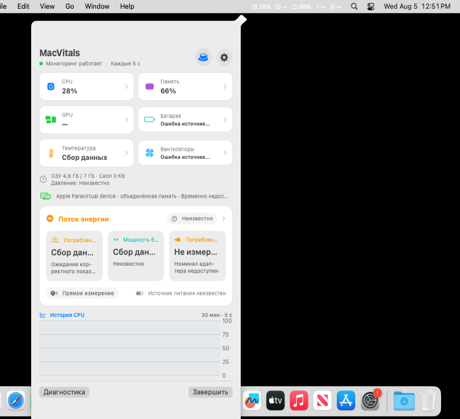
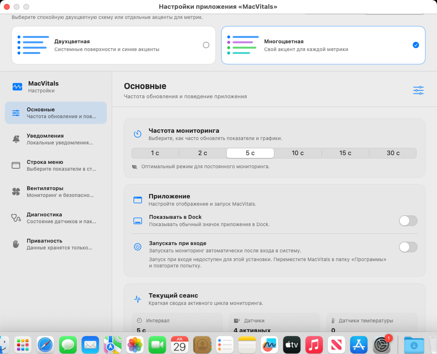
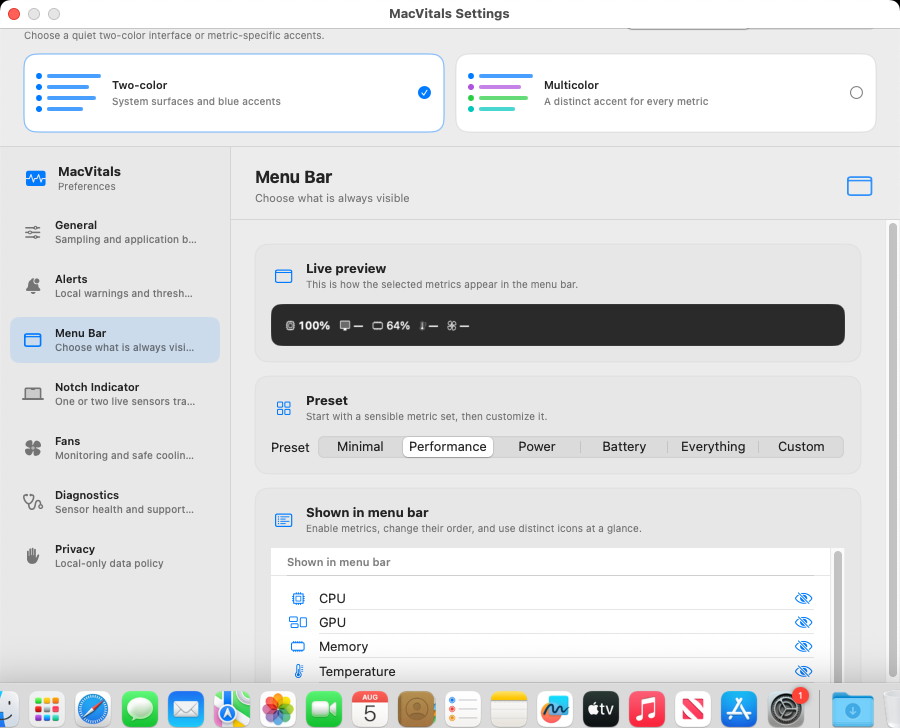
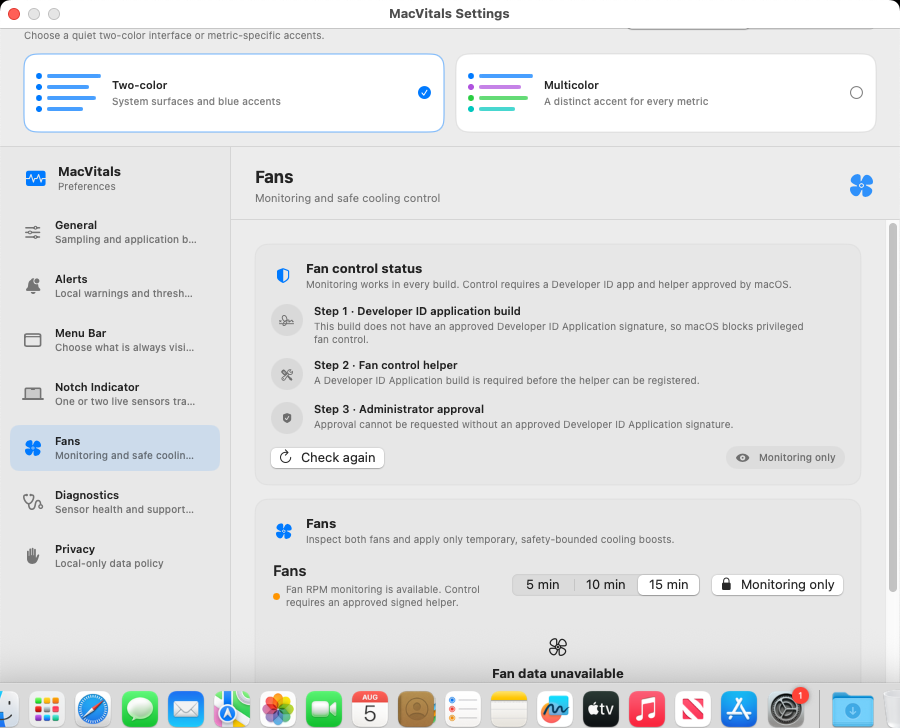
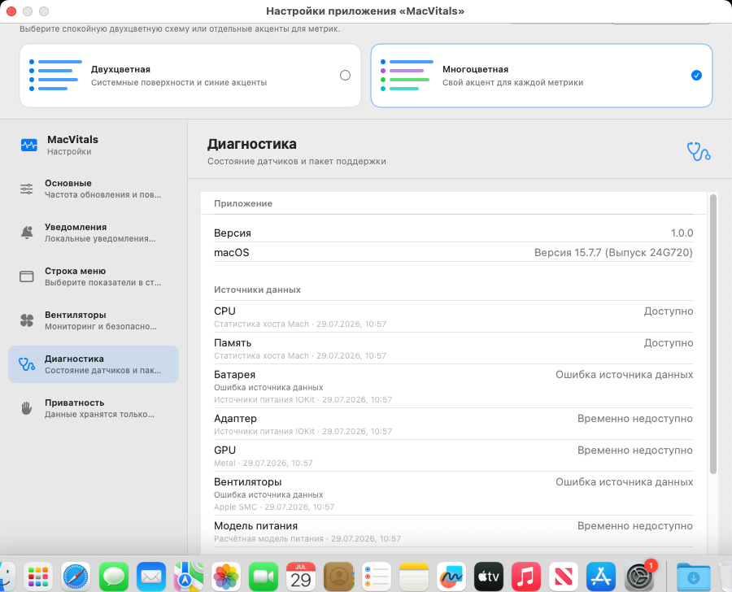

# MacVitals

<p align="center">
  <strong>A native Apple Silicon system monitor that lives in the macOS menu bar</strong>
</p>

<p align="center">
  <code>Apple Silicon</code> · <code>macOS 13+</code> · <code>Swift 6</code> · <code>No telemetry</code> · <code>Local processing</code>
</p>

<p align="center">
  <a href="README.md">Русский</a> · <strong>English</strong>
</p>

MacVitals keeps essential system information close at hand: CPU and memory load, battery and power state, temperatures, high-impact processes and available fan data. It works without accounts, advertising, analytics, cloud services or background data collection.

> **Development status:** MacVitals v1 has been merged into `main` and remains in pre-release validation. The current unsigned Apple Silicon build passes automated build, test, packaging and runtime checks, together with physical read-only fan validation. Developer ID signing, notarization and public release have not been performed.

## What MacVitals shows

- CPU usage from delta-based Mach host counters;
- memory usage and native macOS memory-pressure state;
- battery level, charging state and health;
- adapter rated and negotiated power, kept separate from measured input power;
- direct or derived system-power telemetry with clear source labels;
- battery and processor temperature when supported by the current Mac;
- Metal GPU identity and capabilities without fabricated utilization values;
- read-only fan RPM, limits and operating mode through AppleSMC;
- top process consumers for quicker diagnosis of unexpected load;
- bounded metric history with sleep and wake discontinuities;
- local alerts with cooldown and explicit notification permission handling.

## Interface

MacVitals lives in the macOS menu bar. Key values remain visible without opening a window, while a click reveals a compact overview with metric cards, CPU history, power status and quick access to Preferences.

The interface uses native SwiftUI and AppKit components, supports English and Russian, light and dark appearance, and both duotone and multicolor themes.

## Real application interface

Every image below is captured automatically from the actual MacVitals application built and launched on a GitHub-hosted macOS 15 ARM64 runner. These are direct XCTest captures, not mockups or concept renders.

### Menu bar and quick overview

<p align="center">
  
</p>

<p align="center">
  <sub>The real MacVitals status item and overview popover showing live values from the CI system.</sub>
</p>

### Preferences and diagnostics

<table>
  <tr>
    <td width="50%" valign="top">
      <strong>⚙️ General settings</strong><br>
      <sub>Sampling interval, login launch, Dock visibility and appearance.</sub><br><br>
      
    </td>
    <td width="50%" valign="top">
      <strong>📊 Menu bar</strong><br>
      <sub>Metric presets, ordering and individual menu-bar composition.</sub><br><br>
      
    </td>
  </tr>
  <tr>
    <td width="50%" valign="top">
      <strong>🌀 Fans and safety</strong><br>
      <sub>Sensor availability, current modes and explicit safety limitations.</sub><br><br>
      
    </td>
    <td width="50%" valign="top">
      <strong>🩺 Diagnostics</strong><br>
      <sub>Provider status and export of a privacy-filtered diagnostic report.</sub><br><br>
      
    </td>
  </tr>
</table>

Hardware-dependent values belong to the CI runner, so unavailable battery, adapter, temperature or fan providers are expected in some captures. The reproducible capture workflow is available in [`.github/workflows/readme-screenshots.yml`](.github/workflows/readme-screenshots.yml).

## Supported platform

- Apple Silicon (`arm64`) only;
- macOS 13 or later;
- Intel (`x86_64`) and universal release binaries are intentionally rejected.

## Privacy

All metrics are processed locally. MacVitals makes no network requests and contains no accounts, analytics, telemetry, advertising or cloud backend.

Diagnostic and runtime evidence is designed to omit usernames, home paths, serial numbers, Apple IDs, user documents and network data.

See [PRIVACY.md](PRIVACY.md).

## Important limitations

- macOS does not expose one universal public API for reliable whole-system GPU utilization across supported Macs. MacVitals reports the metric as unavailable when no trustworthy provider exists;
- nominal adapter power is never presented as live system consumption;
- extended battery fields from IORegistry are capability-checked and marked experimental;
- fan monitoring is read-only in unsigned builds. Physical fan control is not claimed as working or release-ready;
- hosted runtime measurements are regression evidence for specific runners, not universal performance promises.

## Build from source

Requirements: Apple Silicon Mac, macOS 13+, Xcode 16+, Homebrew.

```bash
git clone https://github.com/MishkaStrategy/-MacVitals.git
cd -- -MacVitals
git switch main
make bootstrap
open MacVitals.xcodeproj
```

Run validation and tests:

```bash
make validate-tooling
make test
```

Create an explicitly unsigned local package:

```bash
make package VERSION=0.0.0
```

The package output includes:

- `MacVitals-<version>.zip`;
- `MacVitals-<version>.dmg`;
- `SHA256SUMS.txt`;
- `BUILD_STATUS.txt`;
- `BUILD_MANIFEST.json`.

Run the packaged-app runtime smoke used by CI:

```bash
make runtime-smoke VERSION=0.0.0
```

Collect a longer process-level CSV/JSON record from an already running instance:

```bash
make collect-runtime RUNTIME_DURATION=900 RUNTIME_INTERVAL=2
```

These process samples do not replace Instruments energy, wakeup, thermal or physical battery testing.

## Validation status

The current validation pipeline covers:

- formatting and generated-project checks;
- native Apple Silicon build and automated tests;
- packaged application runtime smoke;
- arm64-only unsigned ZIP and DMG packaging;
- application icon, localization, checksum and provenance verification;
- English and Russian Preferences accessibility smoke;
- reproducible capture of the real status item, popover and Preferences windows;
- physical read-only fan RPM evidence;
- physical direct-session stability and Instruments collection.

## Remaining release gates

- Developer ID signing, notarization, stapling and clean-Mac Gatekeeper validation;
- final manual VoiceOver, keyboard and EN/RU visual review;
- representative physical Apple Silicon screenshots and visual review;
- independent review of physical and Instruments evidence;
- explicit authorization before tagging or public release.

## Documentation

- [Русский README](README.md)
- [Architecture](ARCHITECTURE.md)
- [Privacy](PRIVACY.md)
- [Application icon](docs/APP_ICON.md)
- [Power model](docs/POWER_MODEL.md)
- [Sensor compatibility](docs/SENSOR_COMPATIBILITY.md)
- [Performance evidence](docs/PERFORMANCE.md)
- [Build provenance](docs/BUILD_PROVENANCE.md)
- [Release process](docs/RELEASE.md)
