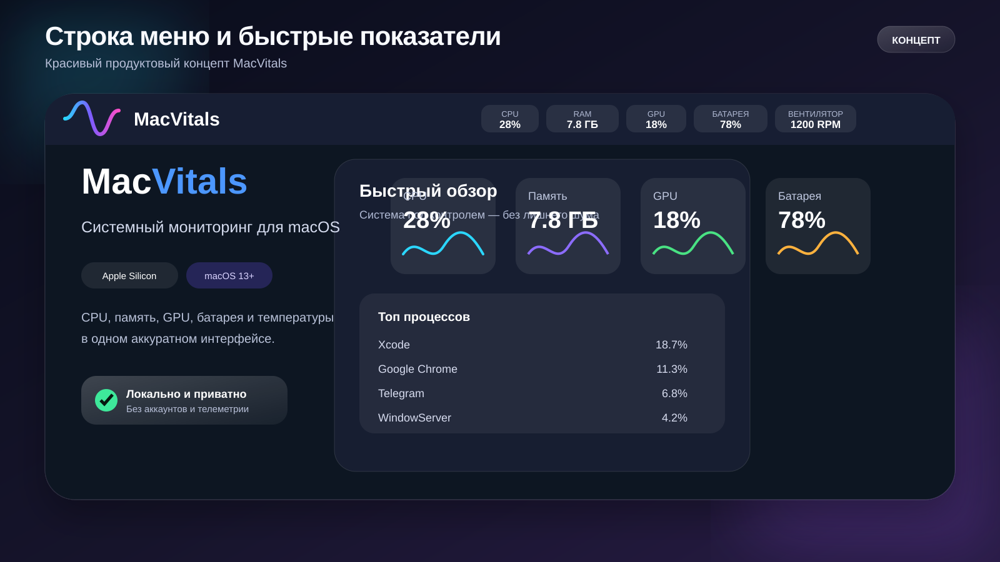
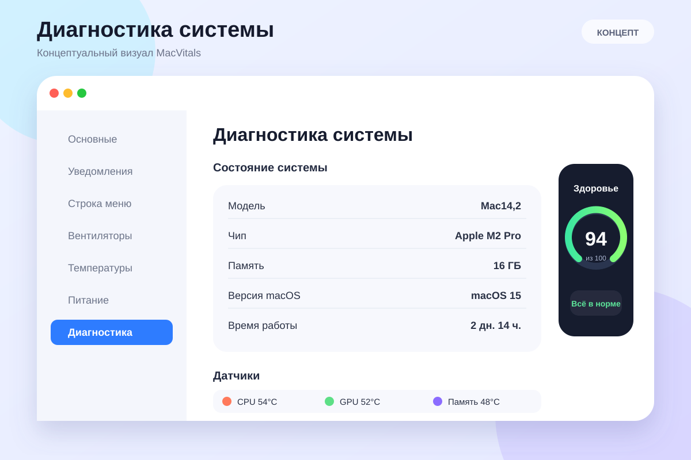
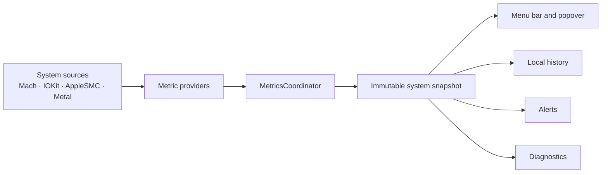

<div align="center">

# MacVitals

### A polished native Mac health monitor for the macOS menu bar

CPU, memory, battery, power, temperatures, processes and available fan data — local, transparent and telemetry-free.

<p>
  
  
  
  
  
</p>

[Русский](README.md) · **English** · [Architecture](ARCHITECTURE.md) · [Privacy](PRIVACY.md)

</div>

<p align="center">
  
</p>

> [!IMPORTANT]
> MacVitals is in pre-release validation. The 1.0.0 codebase builds and tests on Apple Silicon, but a signed and notarized public release has not been published yet. The images in this README are polished product concepts rather than literal captures of the current build.

## About MacVitals

**MacVitals** is a native macOS menu-bar application that keeps essential system information visible without a heavy standalone dashboard and without sending measurements anywhere.

The app brings system metrics into one compact interface, tracks the source and quality of each value, and never replaces missing data with invented numbers. When a sensor or API is unavailable on a particular Mac, MacVitals reports that limitation explicitly.

<table>
  <tr>
    <td width="25%" align="center"><strong>⚡ Fast</strong><br><sub>Native SwiftUI and AppKit, no web wrapper</sub></td>
    <td width="25%" align="center"><strong>🔒 Private</strong><br><sub>Local processing, no accounts or telemetry</sub></td>
    <td width="25%" align="center"><strong>🎯 Honest</strong><br><sub>Unavailable values are never fabricated</sub></td>
    <td width="25%" align="center"><strong> Mac-first</strong><br><sub>Apple Silicon and macOS 13+</sub></td>
  </tr>
</table>

## Core capabilities

| Area | What MacVitals reports |
|---|---|
| **CPU** | Current usage from delta-based Mach host counters and short local history |
| **Memory** | RAM usage and native macOS memory-pressure state |
| **Battery** | Charge level, charging state, health and supported extended fields |
| **Power** | Adapter rated and negotiated power kept separate from measured or derived system power |
| **Temperatures** | Battery and processor temperatures when a trustworthy provider is available |
| **GPU** | Metal GPU identity and capabilities without fabricated utilization |
| **Fans** | Available RPM, limits and modes through AppleSMC; unsigned builds remain safe and read-only |
| **Processes** | Applications and processes consuming the most resources |
| **History** | Bounded in-memory ring buffers with correct sleep and wake handling |
| **Alerts** | Local notifications with cooldown and explicit permission handling |
| **Diagnostics** | Provider state and a user-triggered privacy-filtered JSON support bundle |

## Interface

MacVitals lives in the macOS menu bar. Important values remain visible at a glance, while a click opens a compact overview with metric cards, charts, power state, top processes and quick access to Preferences.

The app supports:

- English and Russian localization;
- light and dark appearance;
- duotone and multicolor themes;
- configurable menu-bar metrics;
- presets and manual metric ordering;
- native keyboard navigation and accessibility identifiers.

### Concept gallery

<table>
  <tr>
    <td width="50%" valign="top">
      <strong>⚙️ General settings</strong><br>
      <sub>Sampling, history, login launch, Dock visibility and appearance.</sub><br><br>
      
    </td>
    <td width="50%" valign="top">
      <strong>📊 Menu bar</strong><br>
      <sub>Metric sets, ordering, format and compact composition.</sub><br><br>
      
    </td>
  </tr>
  <tr>
    <td width="50%" valign="top">
      <strong>🌀 Fans and safety</strong><br>
      <sub>Available RPM values, limitations and explicit safety boundaries.</sub><br><br>
      
    </td>
    <td width="50%" valign="top">
      <strong>🩺 Diagnostics</strong><br>
      <sub>System summary, provider health and privacy-filtered export.</sub><br><br>
      
    </td>
  </tr>
</table>

Real XCTest captures of the running app remain in [`docs/screenshots/`](docs/screenshots/) as technical evidence. Concept visuals are used only to present the intended product direction beautifully.

## Architecture



The architecture separates acquisition, domain models, sampling coordination, presentation and diagnostics:

- `MetricValue` carries value, unit, availability, quality, source, timestamp and estimation state;
- providers do not decide how data should look in the UI;
- `MetricsCoordinator` owns the sampling lifecycle and publishes immutable snapshots;
- AppKit owns `NSStatusItem` and `NSPopover`, while SwiftUI renders content and Preferences;
- short history lives only in bounded in-memory ring buffers;
- sleep resets CPU baselines and power windows and inserts a graph discontinuity;
- v1 intentionally avoids private GPU utilization APIs, databases and network services.

See [ARCHITECTURE.md](ARCHITECTURE.md) for the detailed contract.

## Data integrity principles

1. **Never fabricate missing values.** An unavailable metric is displayed as unavailable.
2. **Separate specifications from measurements.** Adapter wattage is not presented as live Mac consumption.
3. **Expose estimation.** Derived values are distinguished from direct measurements.
4. **Check capabilities at runtime.** Extended providers activate only when the current hardware supports them.
5. **Avoid universal promises.** Sensor coverage depends on the Mac model, macOS version and execution environment.

## Platform requirements

| Component | Requirement |
|---|---|
| Architecture | Apple Silicon (`arm64`) only |
| macOS | 13 Ventura or later |
| Xcode | 16 or later |
| Swift | 6.0 with strict concurrency |
| Project generation | XcodeGen |
| License | MIT |

Intel (`x86_64`) and universal release binaries are intentionally rejected by project validation.

## Build from source

> [!NOTE]
> No signed public build is available yet. The steps below are intended for development and testing.

```bash
git clone https://github.com/MishkaStrategy/-MacVitals.git
cd -- -MacVitals
git switch main
make bootstrap
open MacVitals.xcodeproj
```

Build from Terminal:

```bash
make build
```

Run unit tests:

```bash
make test
```

## Developer commands

| Command | Purpose |
|---|---|
| `make bootstrap` | Materializes the icon, installs XcodeGen when needed and generates the project |
| `make build` | Builds the Debug application for macOS ARM64 |
| `make test` | Runs the MacVitals unit tests |
| `make format` | Formats Swift sources |
| `make lint` | Checks Swift formatting without modifying files |
| `make validate-tooling` | Validates scripts, localizations, metadata and output-path safety |
| `make package VERSION=0.0.0` | Creates explicit unsigned ZIP and DMG packages |
| `make verify-package VERSION=0.0.0` | Verifies package structure and metadata |
| `make runtime-smoke VERSION=0.0.0` | Packages the app and performs a short launch smoke test |
| `make collect-runtime RUNTIME_DURATION=900 RUNTIME_INTERVAL=2` | Collects process-level CPU/RSS/VSZ/thread metrics from a running app |
| `make clean` | Removes generated projects, builds and temporary artifacts |

## Privacy

MacVitals processes system measurements locally and does not transmit them.

The app contains no:

- account system or authentication;
- analytics or telemetry;
- advertising;
- remote configuration;
- cloud backend;
- background diagnostic uploads;
- access to user documents.

A support bundle is created only through an explicit user action and saved to a user-selected location. It excludes usernames, home paths, serial numbers, Apple IDs, personal files, network information and stable hardware identifiers.

See [PRIVACY.md](PRIVACY.md).

## Limitations and safety

- macOS does not provide one universal public API for reliable whole-system GPU utilization across all supported Macs;
- temperature and power coverage depends on the Mac model and macOS version;
- extended battery fields are capability-checked and treated as experimental;
- unsigned builds keep fan monitoring read-only;
- physical fan control is not claimed as a supported or release-ready feature;
- hosted-runner figures are regression evidence, not universal performance guarantees;
- Developer ID signing, notarization, stapling and clean-Mac Gatekeeper validation are still pending.

## Project status

The current validation pipeline covers:

- Xcode project generation and Swift formatting;
- native ARM64 builds;
- unit and UI tests;
- English and Russian localization;
- accessibility smoke testing;
- unsigned ZIP and DMG packaging;
- checksums, manifests and build provenance;
- packaged-app runtime smoke;
- read-only fan RPM validation when available;
- longer process-level measurements and physical Instruments sessions.

Before public release, the project still requires signing, notarization, Gatekeeper validation, final manual UX/accessibility review and explicit authorization to create a tag and release.

## Documentation

- [Русский README](README.md)
- [Architecture](ARCHITECTURE.md)
- [Privacy](PRIVACY.md)
- [Concept visuals](docs/concepts/README.md)
- [Real test captures](docs/screenshots/README.md)
- [Power model](docs/POWER_MODEL.md)
- [Sensor compatibility](docs/SENSOR_COMPATIBILITY.md)
- [Performance evidence](docs/PERFORMANCE.md)
- [Build provenance](docs/BUILD_PROVENANCE.md)
- [Release process](docs/RELEASE.md)
- [Security policy](SECURITY.md)

## Contributing

Issues, proposals and pull requests are welcome. Before contributing, read [CONTRIBUTING.md](CONTRIBUTING.md), the architecture constraints and the security policy.

<div align="center">

**MacVitals is built for people who want to understand their Mac without sending its data elsewhere.**

Released under the [MIT License](LICENSE).

</div>
