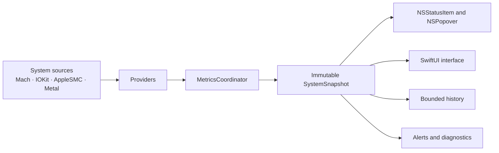

<div align="center">

# MacVitals

### A native Apple Silicon Mac health monitor for the macOS menu bar

CPU, memory, battery, power, temperatures, processes and available fan data — local, transparent and telemetry-free.

<p>
  
  
  
  
  
</p>

[Русский](README.md) · **English** · [Architecture](ARCHITECTURE.md) · [Privacy](PRIVACY.md)

</div>

<p align="center">
  <a href="docs/screenshots/status-bar-overview.png">
    
  </a>
</p>

> [!IMPORTANT]
> MacVitals is in pre-release validation. The 1.0.0 codebase builds and tests for Apple Silicon, but a signed and notarized public release has not been published. Every interface image below was captured by XCTest from a running ARM64 build and is shown without redrawing the application UI.

## About

**MacVitals** is a native macOS menu-bar application that keeps essential system information nearby without a heavy standalone dashboard and without transmitting measurements.

The app combines system metrics in a compact popover, exposes source and availability, and never replaces missing values with guesses. When a sensor or system API is unavailable on a particular Mac, the interface says so explicitly.

<table>
  <tr>
    <td width="25%" align="center"><strong>Native</strong><br><sub>Swift 6, SwiftUI and AppKit with no web wrapper</sub></td>
    <td width="25%" align="center"><strong>Local</strong><br><sub>No accounts, advertising or telemetry</sub></td>
    <td width="25%" align="center"><strong>Transparent</strong><br><sub>Unavailable values are never fabricated</sub></td>
    <td width="25%" align="center"><strong>Apple Silicon</strong><br><sub>ARM64 and macOS 13 or later</sub></td>
  </tr>
</table>

## Capabilities

| Area | What MacVitals reports |
|---|---|
| **CPU** | Current usage from delta-based Mach host counters and short local history |
| **Memory** | RAM, swap and native macOS memory-pressure state |
| **Battery** | Charge level, charging state, health and supported extended fields |
| **Power** | Adapter rated and negotiated power kept separate from direct or derived consumption |
| **Temperatures** | Battery and processor temperature when a trustworthy source is available |
| **GPU** | Metal GPU identity and capabilities; utilization only when a reliable provider exists |
| **Fans** | Available RPM, target and limit values and mode through AppleSMC |
| **Processes** | Applications and processes consuming the most resources |
| **History** | Bounded in-memory ring buffers with discontinuities after sleep and wake |
| **Alerts** | Local notifications with cooldown and explicit permission handling |
| **Diagnostics** | Provider availability, sampling-cycle timing and a privacy-filtered JSON report |

## Real application interface

MacVitals lives in the macOS menu bar. A click opens a compact popover with CPU, memory, GPU, battery, temperature and fan cards, a power summary and local CPU history.

The images below come from the running application rather than design mockups.

<table>
  <tr>
    <td width="50%" valign="top">
      <strong>General settings</strong><br>
      <sub>Sampling, Dock visibility, login launch and current session.</sub><br><br>
      <a href="docs/screenshots/preferences-general.png">
        
      </a>
    </td>
    <td width="50%" valign="top">
      <strong>Menu bar</strong><br>
      <sub>Live preview, presets and metric ordering.</sub><br><br>
      <a href="docs/screenshots/preferences-menu-bar.png">
        
      </a>
    </td>
  </tr>
  <tr>
    <td width="50%" valign="top">
      <strong>Fans and safety</strong><br>
      <sub>The real monitoring-only state of an unsigned build.</sub><br><br>
      <a href="docs/screenshots/preferences-fans.png">
        
      </a>
    </td>
    <td width="50%" valign="top">
      <strong>Diagnostics</strong><br>
      <sub>Provider availability, version and support bundle.</sub><br><br>
      <a href="docs/screenshots/preferences-diagnostics.png">
        
      </a>
    </td>
  </tr>
</table>

> [!NOTE]
> The original PNG files remain in [`docs/screenshots/`](docs/screenshots/), with the reproducible capture workflow in [`.github/workflows/readme-screenshots.yml`](.github/workflows/readme-screenshots.yml). The interface in these images is not redrawn or replaced by a mockup.

## Data integrity principles

1. **Never fabricate missing values.** Unavailable metrics remain unavailable.
2. **Separate specifications from measurements.** Adapter wattage is not presented as live Mac consumption.
3. **Expose provenance.** Direct, derived and experimental values remain distinguishable.
4. **Check capabilities at runtime.** Hardware-dependent providers activate only when available.
5. **Avoid universal promises.** Sensor coverage depends on the Mac model, macOS version and execution environment.

## Architecture



Core boundaries:

- `MetricValue` carries value, unit, availability, quality, source, timestamp and estimation state;
- providers acquire and normalize data but do not decide UI presentation;
- `MetricsCoordinator` owns the sampling lifecycle and publishes immutable snapshots;
- AppKit owns `NSStatusItem`, `NSPopover` and separate windows, while SwiftUI renders their content;
- history is bounded and remains in memory;
- sleep resets CPU baselines and power windows and inserts a chart discontinuity;
- v1 does not use databases, a cloud backend or private GPU utilization APIs.

See [ARCHITECTURE.md](ARCHITECTURE.md).

## Platform

| Component | Requirement |
|---|---|
| Architecture | Apple Silicon (`arm64`) only |
| macOS | 13 Ventura or later |
| Xcode | 16 or later |
| Swift | 6.0 with strict concurrency |
| Project generation | XcodeGen |
| License | MIT |

Intel (`x86_64`) and universal release binaries are intentionally rejected by validation.

## Build from source

> [!NOTE]
> No signed public build is available yet. The steps below are intended for development and testing.

```bash
git clone https://github.com/MishkaStrategy/-MacVitals.git
cd -- -MacVitals
git switch main
make bootstrap
open MacVitals.xcodeproj
```

Build and test:

```bash
make build
make test
```

## Developer commands

| Command | Purpose |
|---|---|
| `make bootstrap` | Materializes the icon, installs XcodeGen when needed and generates the project |
| `make build` | Builds the Debug application for macOS ARM64 |
| `make test` | Runs MacVitals unit tests |
| `make format` | Formats Swift sources |
| `make lint` | Checks Swift formatting without modifying files |
| `make validate-tooling` | Validates scripts, localizations, metadata and output-path safety |
| `make package VERSION=0.0.0` | Creates explicit unsigned ZIP and DMG packages |
| `make verify-package VERSION=0.0.0` | Verifies package structure and metadata |
| `make runtime-smoke VERSION=0.0.0` | Packages the app and performs a short launch smoke test |
| `make collect-runtime RUNTIME_DURATION=900 RUNTIME_INTERVAL=2` | Collects process-level CPU/RSS/VSZ/thread metrics |
| `make clean` | Removes generated projects, builds and temporary artifacts |

## Packages

`make package VERSION=<version>` creates in `dist/`:

- `MacVitals-<version>.zip`;
- `MacVitals-<version>.dmg`;
- `SHA256SUMS.txt`;
- `BUILD_STATUS.txt`;
- `BUILD_MANIFEST.json`.

The current packaging flow intentionally produces unsigned artifacts. Developer ID signing, notarization, stapling and clean-Mac Gatekeeper validation remain separate release gates.

## Privacy

MacVitals processes measurements locally and does not transmit them.

The app contains no accounts, analytics, telemetry, advertising, remote configuration, cloud backend or background diagnostic uploads. A support bundle is created only through explicit user action and excludes usernames, home paths, serial numbers, Apple IDs, personal documents, network data and stable hardware identifiers.

See [PRIVACY.md](PRIVACY.md).

## Limitations and safety

- macOS does not provide one universal public API for trustworthy whole-system GPU utilization across all supported Macs;
- temperature, battery, power and fan coverage depends on the model and macOS version;
- extended battery fields are capability-checked and treated as experimental;
- nominal, negotiated, direct and derived power values remain separate;
- unsigned builds remain in fan-monitoring mode;
- a signed-helper path in the code does not mean physical control has passed release and independent hardware validation;
- hosted-runner figures are regression evidence for a specific environment, not universal performance guarantees;
- public release requires signing, notarization, stapling, Gatekeeper and final manual validation.

## Project status

The automated pipeline covers Xcode project generation, Swift formatting, native ARM64 builds, unit and UI tests, English and Russian localization, accessibility smoke tests, unsigned ZIP/DMG packaging, checksums, manifests, provenance and packaged-app runtime smoke.

Physical and long-running performance work remains separate and does not become a marketing promise. Public release still requires Developer ID signing, notarization, Gatekeeper validation, final manual UI review and explicit owner authorization for a tag and GitHub Release.

## Documentation

- [Русский README](README.md)
- [Architecture](ARCHITECTURE.md)
- [Privacy](PRIVACY.md)
- [Real test captures](docs/screenshots/README.md)
- [Power model](docs/POWER_MODEL.md)
- [Sensor compatibility](docs/SENSOR_COMPATIBILITY.md)
- [Performance evidence](docs/PERFORMANCE.md)
- [Build provenance](docs/BUILD_PROVENANCE.md)
- [Release process](docs/RELEASE.md)
- [Security policy](SECURITY.md)

## Contributing

Before opening an issue or pull request, read [CONTRIBUTING.md](CONTRIBUTING.md), the architecture constraints and the security policy.

<div align="center">

**MacVitals helps people understand their Mac without sending its data elsewhere.**

Released under the [MIT License](LICENSE).

</div>
